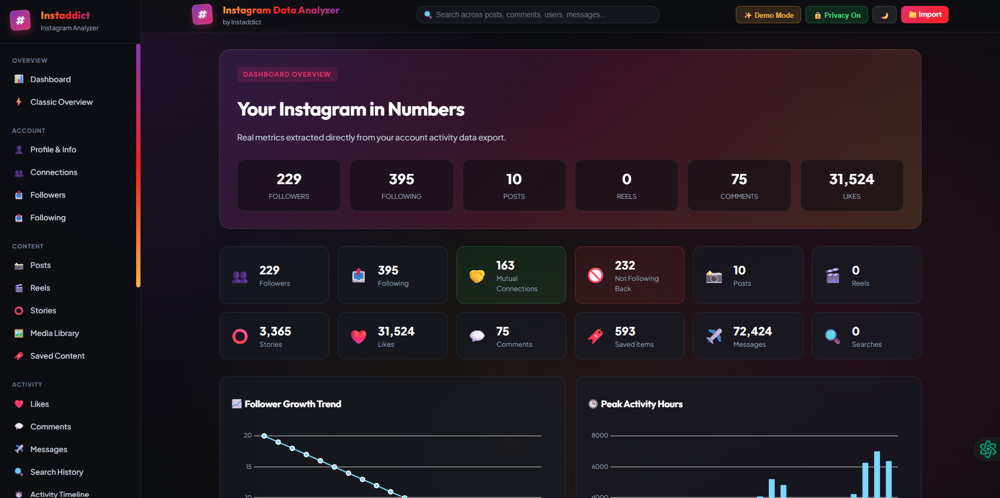

this is update
# 📸 Instagram Data Analyzer (by Instaddict)

> **Understand your Instagram activity, connections, content and account data.**  
> Instaddict has been upgraded into a complete **Instagram Data Analyzer & Personal Dashboard**. Process your official Instagram data package 100% privately on your local device — zero servers, zero scraping, zero login credentials required!



[](https://opensource.org/licenses/MIT)
[](https://svelte.dev)
[](#-privacy--security)

---

# 📸 Instagram Data Analyzer

> Explore. Analyze. Understand your Instagram data.

Instagram Data Analyzer is a privacy-focused web application that helps users
explore and understand their own Instagram data exports.

Import an Instagram data export and get a complete interactive dashboard for
connections, followers, following, posts, reels, stories, likes, comments,
saved content, messages, activity history, security information, media,
advertising information, and more.

The application is designed to process exported data locally without requiring
Instagram login credentials.

---

## ✨ Features

### 📥 Universal Instagram Data Import

- Import Instagram ZIP exports
- Import extracted Instagram folders
- Import individual JSON files
- Automatic file and folder detection
- Automatically detect available Instagram data categories
- Support multiple files such as `followers_1.json`, `followers_2.json`, etc.
- Missing data is handled gracefully
- Unknown JSON files can be explored through the Data Explorer

---

## 📊 Dashboard

The dashboard provides an overview of your Instagram data.

- Followers
- Following
- Posts
- Reels
- Stories
- Likes
- Comments
- Saved content
- Messages
- Searches
- Activity timeline
- Followers vs following
- Mutual connections
- Non-followers
- Activity by month
- Activity by weekday
- Activity by hour

---

## 👥 Connections

Analyze your Instagram connections:

- Followers
- Following
- Mutual connections
- Non-followers
- People you don't follow back
- Close friends
- Blocked profiles
- Pending follow requests
- Recent follow requests
- Recently unfollowed profiles
- Removed suggestions

Connection data can be searched, filtered and explored.

---

## ❤️ Activity Analysis

Explore your Instagram activity:

- Likes
- Comments
- Saved content
- Searches
- Story interactions
- Posts
- Reels
- Messages
- Follow/unfollow activity
- Account activity

---

## 🖼️ Media Explorer

Explore media included in your Instagram export:

- Posts
- Stories
- Reels
- Images
- Videos
- Profile media
- Other media

Includes search, filtering, preview and media categorization.

---

## 💬 Messages

If message data is included in your Instagram export, the application can
display available conversations and message information.

The application does not create or invent missing messages.

---

## 🔐 Security & Privacy

Explore available security-related information:

- Login activity
- Logout activity
- Profile activity
- Profile privacy changes
- Device information
- Location information
- Signup information
- Connected applications and websites

Sensitive information can be masked where appropriate.

---

## 📢 Ads Information

If available in the export:

- Advertising information
- Advertisers
- Ad interactions
- Interest categories
- Advertising activity

---

## 🧭 Data Explorer

The Data Explorer allows you to inspect your Instagram export directly.

Example:

```text
Instagram Export
│
├── ads_information
├── connections
├── personal_information
├── preferences
├── security_and_login_information
├── apps_and_websites_off_of_instagram
├── your_instagram_activity
├── logged_information
└── media
